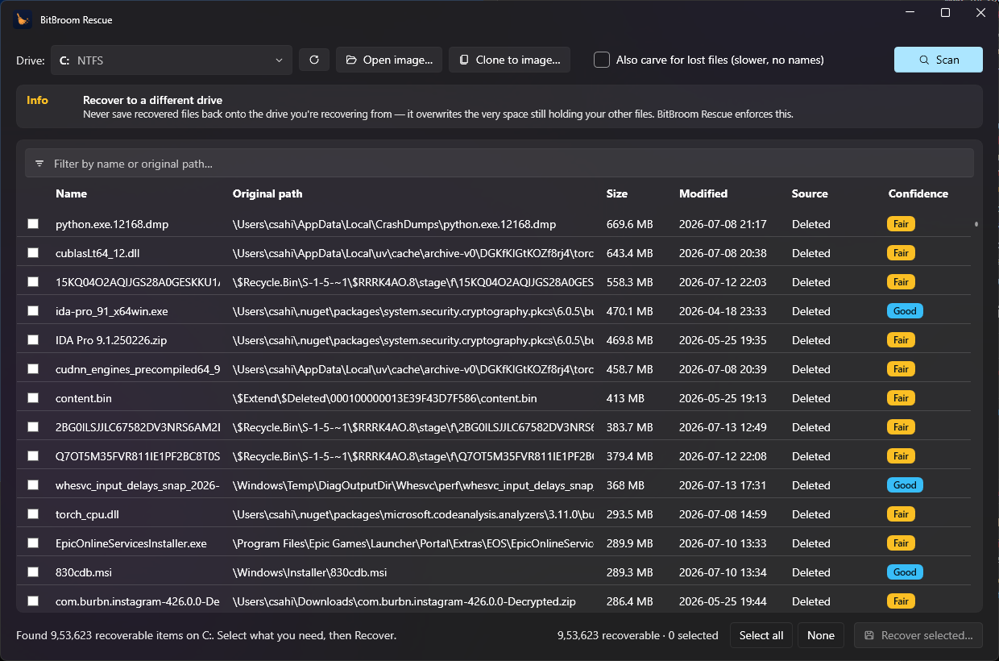

<div align="center">


# BitBroom Rescue

**Safety-first, open-source data recovery for Windows 10/11.**
Deleted a file? Formatted a card? Drive failing? Get your data back — without making things worse.

[](https://bitbroom.app)
[](https://github.com/pwnapplehat/BitBroom.Rescue/actions)
[](LICENSE)
[](https://dotnet.microsoft.com/)

Part of the [BitBroom](https://github.com/pwnapplehat/BitBroom) family · no ads · no telemetry · no "activate to recover" ransom screens

</div>

---

## Why another recovery tool?

Because most of them get the two things that matter wrong:

1. **They endanger the very data you're trying to save.** Installing to, scanning from, or — worst — recovering *onto* the source drive overwrites deleted data. Many popular tools let you do all three without a word.
2. **They lie about your chances.** Free tiers that show you the file but ransom the bytes. "Deep scans" that report thousands of "recoverable" files that are actually zeroed by SSD TRIM. Green checkmarks on garbage.

BitBroom Rescue is built the opposite way:

- **The source drive is opened read-only. Always.** The I/O layer physically has no write path (`ISectorSource` exposes reads only). Nothing is ever written to the drive being recovered — no scan cache, no index, no "helper" files.
- **Recovery to the same drive is refused**, not warned about — enforced by a destination guard before a single byte is written.
- **Clone-first for failing hardware.** A ddrescue-style two-pass imager copies what's readable, maps what isn't, and lets you run every scan against the image so the dying drive is stressed exactly once.
- **Honest confidence, honest TRIM warnings.** Every result is scored (High / Good / Fair / Poor) with the reason. On a TRIMmed SSD we tell you the truth — deleted data is likely gone — instead of selling you hope.
- **Free means free.** MIT licensed. Scan results are real results; recovery is never paywalled.

<div align="center">

<br/><sub>A real scan of a live system drive: 953k deleted files enumerated read-only in ~10 seconds, each with source and scored confidence.</sub>
</div>

## What it recovers

| Source | How | Confidence |
|---|---|---|
| **Recycle Bin** | `$I`/`$R` pairs parsed for original path + deletion time | High — file is intact |
| **NTFS deleted files** | Full MFT walk: deleted records, path reconstruction, resident + non-resident data via runlists | High → Poor, scored per file |
| **FAT32 deleted files** (USB sticks, SD cards) | Directory entries (0xE5), long names stitched from surviving LFN entries, contiguous fallback | Fair (FAT clears the chain) |
| **exFAT deleted files** (large cards, portable SSDs) | Directory entry sets with the in-use bit cleared, full long names | Fair |
| **Previous versions** | Volume Shadow Copy snapshots (when Windows kept one) | High — snapshot is intact |
| **Lost/formatted data** | Signature carving: JPEG, PNG, GIF, BMP, WebP, HEIC, PDF, ZIP/DOCX/XLSX, MP4/MOV (box-aware sizing), MP3, WAV, AVI, MKV, 7z, RAR, SQLite… each with a format validator | By format validation |
| **Failing drives** | Clone-first imaging with bad-sector map, then recover from the image | — |

## Quick start

**Portable on purpose — there is no installer.** Installing software onto the drive
you're recovering from can overwrite the very sectors holding your deleted files.
Download the zip from [Releases](https://github.com/pwnapplehat/BitBroom.Rescue/releases),
unzip it on a *different* drive (or a USB stick), and run.

**GUI** — run `BitBroomRescue.exe` (asks for Administrator — raw disk access needs it):

1. Pick the drive (or open a clone image).
2. **Scan** — read-only, shows everything recoverable with confidence scores.
3. Filter, select, **Recover** — to a *different* drive (enforced).

**CLI** — `bitbroom-rescue.exe`, same engine, scriptable:

```powershell
bitbroom-rescue list                              # volumes + physical disks
bitbroom-rescue scan   E                          # deleted files on E: (read-only)
bitbroom-rescue bin    C                          # what's sitting in the Recycle Bin
bitbroom-rescue carve  E                          # signature-carve lost files
bitbroom-rescue recover E --out D:\rescued        # recover (destination guard enforced)
bitbroom-rescue image  E --out D:\sdcard.img      # clone-first for failing drives
bitbroom-rescue scan   D:\sdcard.img              # then scan the image, not the drive
bitbroom-rescue health 1                          # SSD/TRIM/SMART advisory for disk 1
bitbroom-rescue previous C Users\me\Documents\report.docx   # shadow-copy versions
```

## The first rule of data recovery

**Stop writing to the drive.** Every download, browser session, and Windows update can overwrite the sectors holding your file. Ideally:

1. Stop using the affected drive immediately.
2. Run BitBroom Rescue from a *different* drive (it's a single portable exe).
3. Recover to a *different* drive (enforced — you couldn't get this wrong if you tried).
4. Failing/clicking drive? **Image it first** (`image` command or *Clone to image…* button), then work from the image.

## Honesty corner (read before hoping)

- **SSD + TRIM:** when Windows deletes a file on a TRIMmed SSD, the controller erases those blocks — usually within minutes. Metadata scans will still find the *names*; the *content* frequently comes back as zeros. Recycle Bin and Shadow Copies still work. We warn instead of upselling.
- **Overwritten data is gone.** No consumer software recovers overwritten sectors. Anyone claiming otherwise is selling something.
- **Encrypted volumes** (BitLocker) must be unlocked first; scan the unlocked volume letter.

## Architecture

```
src/
  BitBroom.Rescue.Core/      # engine: no UI, no elevation assumptions, fully unit-tested
    Io/                      # read-only sector sources: raw device, image file, memory
    Ntfs/                    # boot sector, MFT parser (fixup, runlists), volume walker
    Fat/                     # FAT12/16/32 + exFAT parsers, deleted-entry recovery
    Carving/                 # signature library, validators, MP4/MOV box-aware carver
    Imaging/                 # ddrescue-style two-pass imager + bad-sector map
    Health/                  # SSD/TRIM/SMART probes, honest advisories
    RecycleBin/              # $I/$R parsing
    Vss/                     # shadow-copy enumeration + previous versions
    Recovery/                # session orchestration, confidence scoring,
                             # destination guard, audit-logged writer
  BitBroom.Rescue.Cli/       # scriptable CLI over the same engine
  BitBroom.Rescue.App/       # WPF Fluent UI (Windows 11 style)
tests/
  BitBroom.Rescue.Core.Tests/  # synthetic NTFS/FAT32/exFAT disk images, byte-exact round-trips
```

The engine is tested against **synthetic disk images built in memory** — real boot sectors, real MFT records with fixup, real FAT chains — so parsing is verified byte-exact on every CI run, no hardware needed. It has also been validated on real hardware: NTFS system drives (955k+ deleted files enumerated), real USB sticks, and a genuinely failing flash drive that died mid-image (the bad-sector map and partial-image recovery worked as designed).

## Building

```powershell
dotnet build BitBroom.Rescue.slnx          # build everything
dotnet test                                 # run the test suite
./build/publish.ps1 -Runtime win-x64        # self-contained single-file exes → dist/
```

Requires the .NET 10 SDK on Windows.

## Safety model

See [docs/SAFETY.md](docs/SAFETY.md) for the full write-up: the read-only I/O type system, the destination guard, clone-first imaging, and what we refuse to do even if asked.

## License

[MIT](LICENSE) — © 2026 BitBroom Contributors. Made by iOS_hAT.
